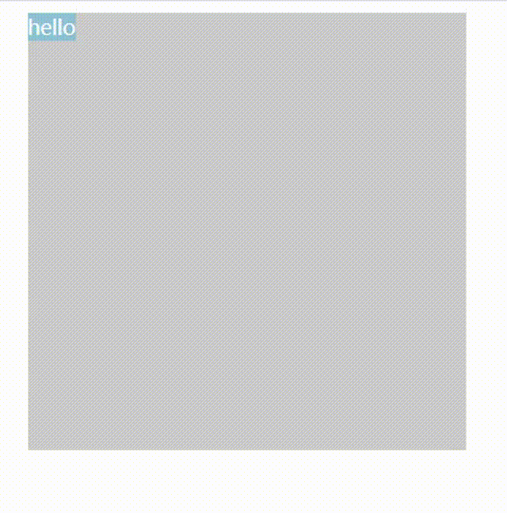
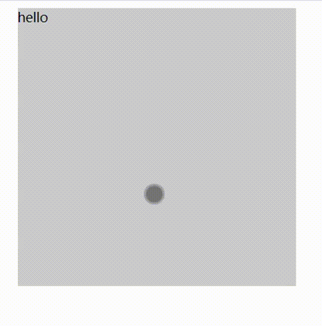

browser-touchlib
===

| **browser-touchlib**
| [browser-touchlib](https://github.com/x2jia/touch-lib)



```html
<!DOCTYPE html>
<html>
  <head>
  <meta content="width=device-width, initial-scale=1.0, maximum-scale=1.0, user-scalable=0" name="viewport"/>
  <meta charset='utf-8'>
  <script type="text/javascript" charset="utf-8" src="http://cdn.staticfile.org/jquery/1.12.4/jquery.min.js"></script>
  <script type="text/javascript" charset="utf-8" src="./../index.js"></script>
  <title>test</title>
  <style>
    html, body {
      background-color: #fff;
      background-repeat: no-repeat;
      -webkit-font-smoothing: antialiased;
      height: 100%;
      font-size: 14px;
    }
    .area {
      background-color: #ccc;
      width: 300px;
      height: 300px;
      margin: auto;
    }
  </style>
  <script type="text/javascript">
    $(function(){
      const id1 = window.jFingerSlideMob.register('area', {
        handler(event){
          console.log(event.type, event)
        },
        option: {
          scale: 1,
          orientation: '-|',
          style: 'font-size: 54px',
          tip: true
        }
      })
      setTimeout(() => {
        window.jFingerSlideMob.unregister(id1)
      }, 5000)

    })
  </script>
</head><body>
  <div id="area" class="area" style="touch-action: none;" >
    hello
  </div>
</body></html>
```



```js
    const jFingerSlideMob = require('browser-touchlib')($)

    const moveid = jFingerSlideMob.register('midea-wrapper', {
      handler: (event) => {
        if(event.type !== 'touchmove'){
          this.state.currentTime = -1;
        }else{
          const duration = myPlayer.duration()
          if(typeof duration === 'number' && duration > 0){
            if(this.state.currentTime < 0){
              this.state.currentTime = myPlayer.currentTime()
            }

            var progress = Math.floor(this.state.currentTime + event.progressX * duration)
            if(progress > duration){
              progress = duration
            }
            if(progress < 0){
              progress = 0
            }
            myPlayer.currentTime(progress)
          }
        }
      },
      option: {
        scale: 0.7,
        orientation: '-',
        style: 'font-size: 54px; color: #fe9; position: absolute; top: 0; right: 0;',
        tip: true,
      }
    })
```

### API

**register(id, object)**

***id***, string,  An html element id or null

***object*** : {  
  handler, A callback function,  (event) => {}  
  option: {  
    scale，number,  (0, ∞)  
    style，string  
    tip, boolean  
    orientation, string,  {"-","|","-|"}  
  }  
}

***return value***
A unique value，unregister will use it

**unregister(return_value)**

***return_value***, A unique value returned by register

### License

996ICU License
